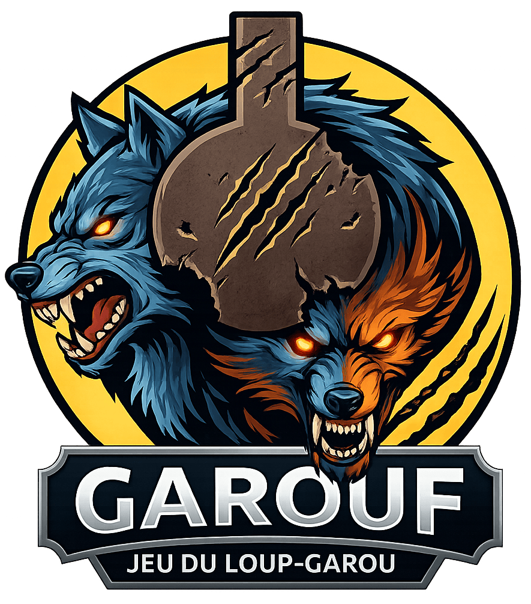
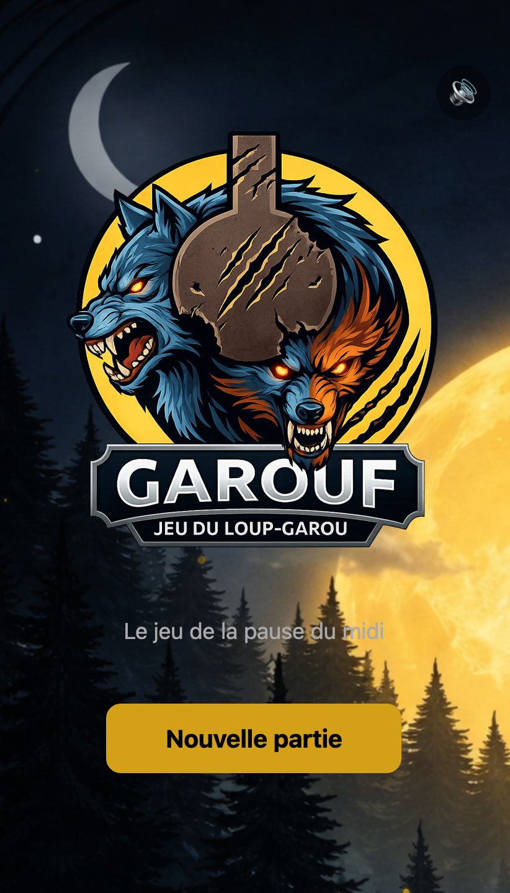
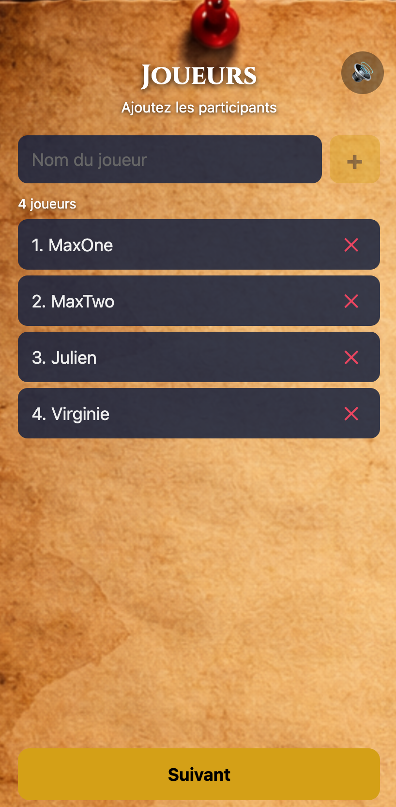
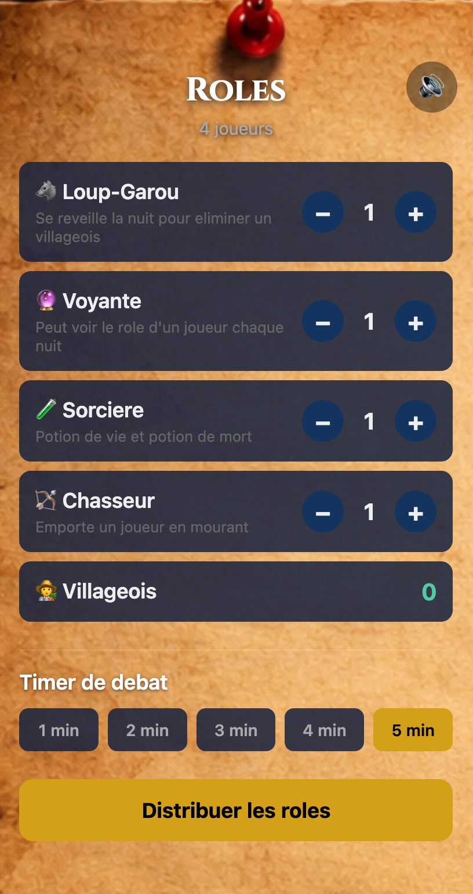
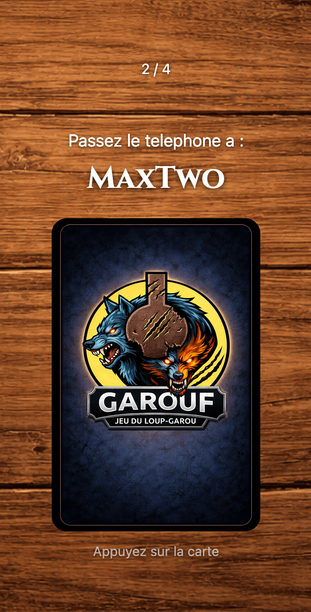
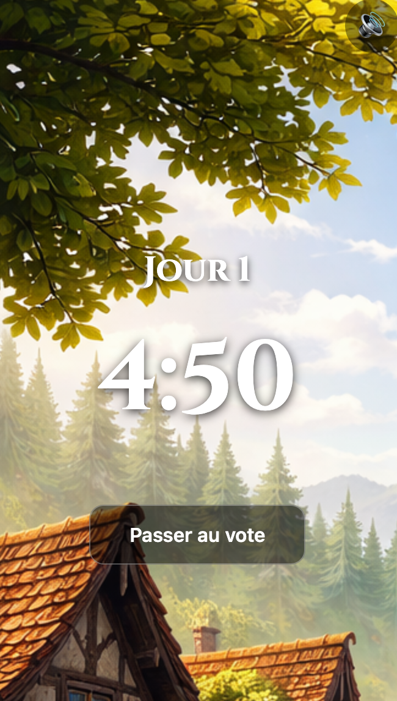
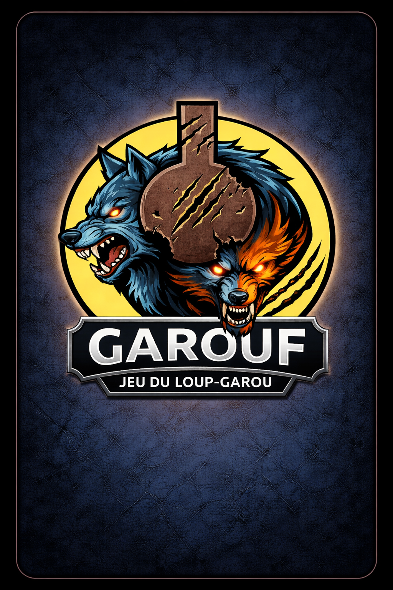

<p align="center">
  
</p>

<h1 align="center">Garouf</h1>

<p align="center">
  <strong>Le Loup-Garou de Thiercelieux, version maitre du jeu sur mobile.</strong><br/>
  Une seule application, un seul telephone — orchestrez vos parties entre amis sans avoir besoin de cartes physiques.
</p>

<p align="center">
  
  
  
</p>

---

## Le concept

**Garouf** remplace le maitre du jeu et le paquet de cartes. Un seul telephone circule entre les joueurs : l'application guide chaque phase de la partie, gere les roles, les tours de nuit et les votes du jour — le tout accompagne de musiques d'ambiance et d'une narration sonore immersive.

Pas de serveur, pas de comptes, pas d'internet requis. Tout tourne en local sur le telephone.

---

## Apercu du jeu

<p align="center">
  
  
  
  
  
</p>

---

## Les roles

<table align="center">
  <tr>
    <td align="center" width="200">
      <br/>
      <strong>Loup-Garou</strong><br/>
      <em>Chaque nuit, les loups-garous se reveillent et choisissent une victime a devorer.</em>
    </td>
    <td align="center" width="200">
      <br/>
      <strong>Voyante</strong><br/>
      <em>Chaque nuit, elle peut espionner le role d'un joueur.</em>
    </td>
    <td align="center" width="200">
      <br/>
      <strong>Sorciere</strong><br/>
      <em>Elle possede une potion de vie et une potion de mort, utilisables une seule fois.</em>
    </td>
  </tr>
  <tr>
    <td align="center" width="200">
      <br/>
      <strong>Chasseur</strong><br/>
      <em>S'il meurt, il emporte un autre joueur avec lui d'un dernier tir.</em>
    </td>
    <td align="center" width="200">
      <br/>
      <strong>Villageois</strong><br/>
      <em>Aucun pouvoir, mais leur vote est leur arme. A eux de demasquer les loups !</em>
    </td>
    <td></td>
  </tr>
</table>

---

## Deroulement d'une partie

```
🌙 Configuration     →  Ajout des joueurs et choix des roles
🃏 Distribution      →  Chaque joueur decouvre secretement son role
🐺 Nuit              →  Les loups-garous, la voyante et la sorciere agissent
☀️ Jour              →  Debat et vote pour eliminer un suspect
🔁 Cycle             →  Nuit et jour alternent jusqu'a la victoire
🏆 Fin               →  Les loups-garous ou les villageois l'emportent
```

---

## Installation

### Prerequis

- [Node.js](https://nodejs.org/) (v18+)
- [Expo CLI](https://docs.expo.dev/get-started/installation/)
- Un simulateur iOS / emulateur Android ou l'app [Expo Go](https://expo.dev/go) sur votre telephone

### Lancer le projet

```bash
# Cloner le depot
git clone https://github.com/MaxouCrn/loup_garou.git
cd loup_garou

# Installer les dependances
npm install

# Demarrer le serveur Expo
npx expo start
```

Scannez le QR code avec Expo Go (Android) ou l'appareil photo (iOS) pour lancer le jeu.

---

## Stack technique

| Technologie | Usage |
|---|---|
| **React Native** | Framework mobile cross-platform |
| **Expo** | Toolchain et runtime |
| **expo-router** | Navigation basee sur le systeme de fichiers |
| **expo-av** | Musiques d'ambiance et effets sonores |
| **React Context + useReducer** | Gestion d'etat centralisee (pas de backend) |
| **TypeScript** | Typage statique |

---

## Licence

Projet personnel — tous droits reserves.
